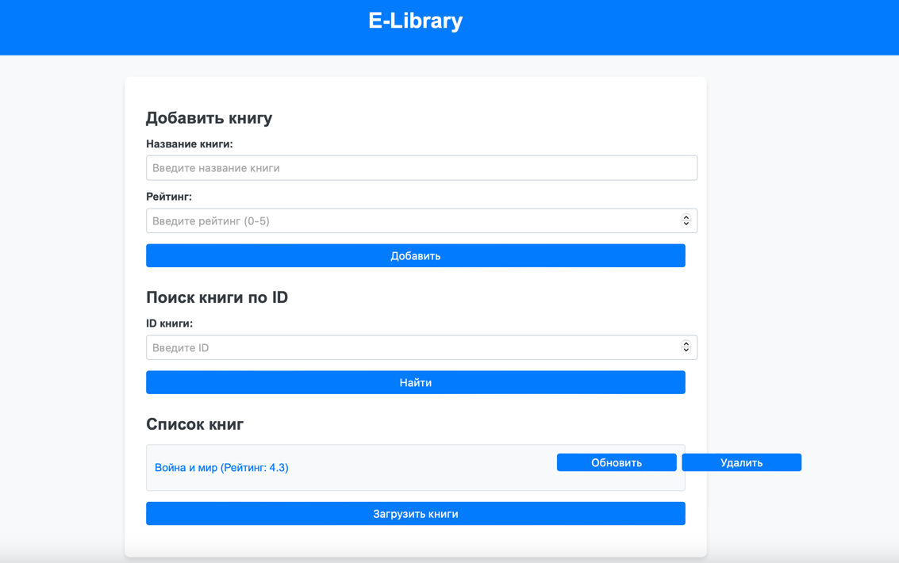

# E-Library

## Project Description

E-Library is an online library application that allows users to search, add, update, and delete books. The project provides functionality to search for books by name and interact with a database to store information about the books, such as title, rating, and creation/update timestamps. It is aimed at users who want to manage their book collection easily or work with book data via a web interface or API.

## Project Members

- **Tugelbayev Galymzhan** 
- **Nurlan Aidyn**

## Screenshot of the Main Page



## How to Run the Project

1. Make sure you have [Go](https://golang.org/dl/) installed.
2. Clone the repository:
    ```bash
    git clone https://github.com/yourusername/E-Library.git
    ```
3. Navigate to the project directory:
    ```bash
    cd E-Library
    ```
4. Set up the PostgreSQL database:
   - Ensure PostgreSQL is running.
   - Create a database named `library`.
   - Verify that the connection details in the code (e.g., username, password) are correct.
5. Install dependencies and run the server:
    ```bash
    go run main.go
    ```
6. Open a web browser and go to [http://localhost:8080](http://localhost:8080) to see the website in action.

## Tools and Resources Used

- **Go** — Main programming language.
- **GORM** — ORM for database interaction.
- **PostgreSQL** — Database management system.
- **HTML and Go templates** — For creating the web interface.
- **JavaScript** — For client-server interaction.

## Repository Structure

- `main.go` — The main server file.
- `templates/` — Directory containing HTML templates.
- `screenshots/` — Directory with images for documentation.
- `README.md` — Project documentation file.


